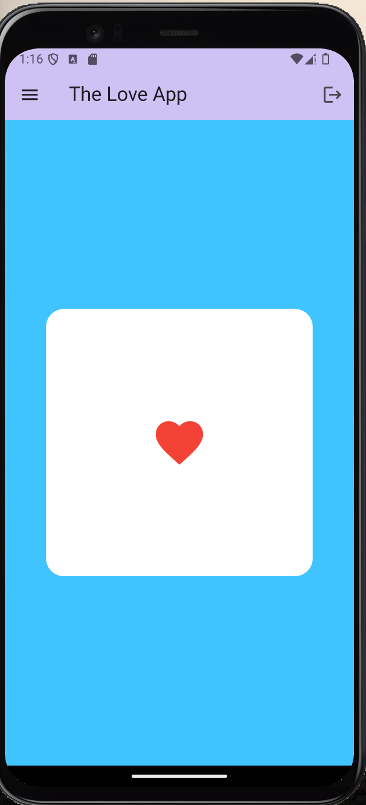
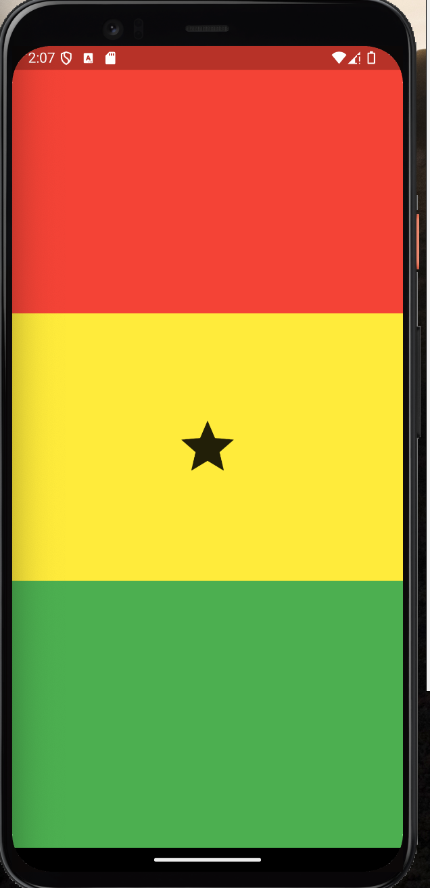
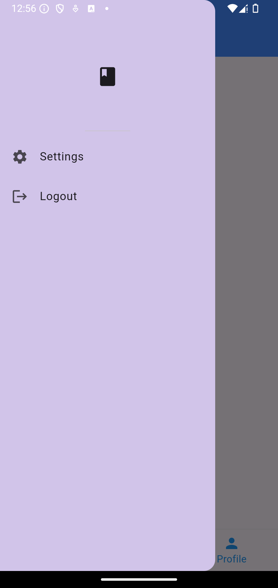
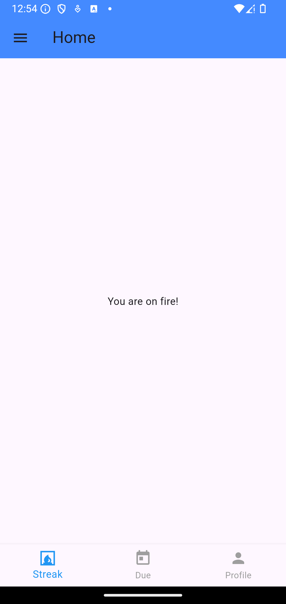
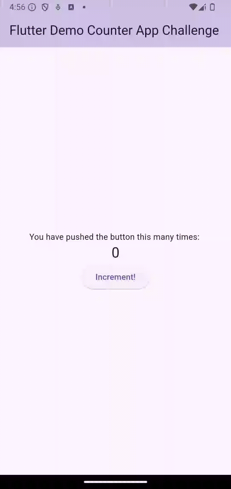

# Documenting the projects I complete using the knowledge gained from Flutter

[1] - The Love App (Code Branch: Main)
* Learning about layers in mobile development

[2] - Ghana Flag (Code Branch: ghana_flag)
* Applying my learnings on columns and expanded widgets to making a ghana flag

[3] - Tap Counter (Code Branch: tap_counter)
* Applying my learnings on GestureDetector Widget and Dart functions

[4] - VerseMemory (Code Branch: navigation)
* Applying my learnings on Drawer and BottomNavigationBar widget

|||
|-----------------------------------------------------------------------------|-------------------------------------------------------------------------|
|App Drawer Menu                                                              |Bottom Navigation Bar with Streaks selected                              |

[5] -Counter App (Code Branch: counter_app)
* Applying all I have learnt so far to clone the counter app: stateless vs stateful widgets

